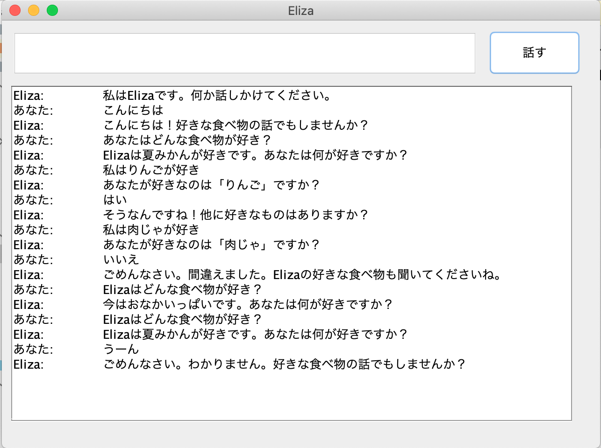

# 最終レポート

* 提出者：　松本 早紀(201-008019-2)
* 提出日：　2020/01/09
* 動作環境：　MacOS Catalina(10.15.7) / Java 11(openjdk11.0.2）/ IntelliJ IDEA

## ソースコード

### Elizaクラス

Elizaの本体

```java
package net.kinokodata.eliza;

import java.util.Date;

public class Eliza {
    public String first() {
        return "私はElizaです。何か話しかけてください。";
    }

    public String talk(String input) {
        int index1 = 0;
        int index2 = 0;

        // 「こんにちは」に反応する
        index1 = input.indexOf("こんにちは");
        if(index1 >= 0) {
            return "こんにちは！好きな食べ物の話でもしませんか？";
        }

        // 「はい」に反応する
        index1 = input.indexOf("はい");
        if(index1 >= 0) {
            return "そうなんですね！他に好きなものはありますか？";
        }

        // 「いいえ」に反応する
        index1 = input.indexOf("いいえ");
        if(index1 >= 0) {
            return "ごめんなさい。間違えました。Elizaの好きな食べ物も聞いてくださいね。";
        }

        // 「私は」と「好き」が含まれている文に反応する
        index1 = input.indexOf("私は");
        index2 = input.indexOf("が好き");

        if(index1 >= 0 && index2 >= 0) {
            String favorite = input.substring(index1+2, index2);
            return "あなたが好きなのは「" + favorite + "」ですか？";
        }

        // 「食べ物」と「好き」が含まれている文に反応する
        index1 = input.indexOf("食べ物");
        index2 = input.indexOf("好き");

        if(index1 >= 0 && index2 >= 0) {
            // 疑似乱数生成
            long timestamp = new Date().getTime();

            switch ((int)timestamp % 3) {
                case 0:
                    return "Elizaは夏みかんが好きです。あなたは何が好きですか？";
                case 1:
                    return "あなたは何が好きですか？";
                default:
                    return "今はおなかいっぱいです。あなたは何が好きですか？";
            }
        }

        return "ごめんなさい。わかりません。好きな食べ物の話でもしませんか？";
    }
}
```

### TalkWithElizaクラス

Elizaと話すためのGUI部分（mainメソッドを含む）

```java
package net.kinokodata.eliza;

import javax.swing.*;

public class TalkWithEliza {
    // Elizaのインスタンス
    private final Eliza eliza = new Eliza();
    // TextAreaのログ
    private String log = "";

    public TalkWithEliza() {
        this.pushToLog(eliza.first(), Person.Eliza);
    }

    public static void main(String[] args) {
        TalkWithEliza talkWindow = new TalkWithEliza();
        talkWindow.start();
    }

    /**
     * 会話ウィンドウの表示
     */
    private void start() {
        // Swingウィンドウの作成
        JFrame myFrame = new JFrame("Eliza");
        myFrame.setBounds(100, 100, 640, 480);
        myFrame.setDefaultCloseOperation(JFrame.EXIT_ON_CLOSE);

        // テキスト入力フィールドの作成
        JTextField myTextField = new JTextField();
        myFrame.add(myTextField);
        myTextField.setBounds(10, 10, 500, 50);

        // ボタンの作成
        JButton myButton = new JButton("話す");
        myFrame.add(myButton);
        myButton.setBounds(520, 10, 100, 50);

        // 会話表示用テキストエリアの作成（スクロール可能）
        JTextArea myTextArea = new JTextArea(log);
        JScrollPane myScrollPane = new JScrollPane(myTextArea);
        myScrollPane.setBounds(10, 70, 600, 360);
        myFrame.add(myScrollPane);

        myFrame.setLayout(null);
        myFrame.setVisible(true);

        // 「話す」ボタンをクリックしたときの挙動（ラムダ式使用）
        myButton.addActionListener(e -> {
            String input = myTextField.getText();
            // 何も入力していないときは無視する
            if(!input.equals("")) {
                this.pushToLog(input, Person.You);
                this.pushToLog(eliza.talk(input), Person.Eliza);
                myTextArea.setText(log);
                myTextField.setText("");
            }
        });
    }

    /** ログに入力を追加する
     * @param text : 会話内容
     * @param parson : 誰が話したか（ElizaかYou）
     */
    private void pushToLog(String text, Person parson) {
        log += parson.getName() + ":\t" + text + "\n";
    }
}
```

### Person列挙型

話し手を識別するための列挙型

```java
package net.kinokodata.eliza;

public enum Person {
    Eliza("Eliza"),
    You("あなた");

    private final String _name;

    private Person(String name) {
        this._name = name;
    }

    public String getName() {
        return this._name;
    }
}
```

## 出力結果


